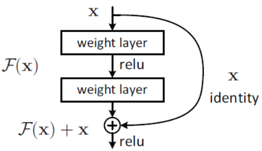
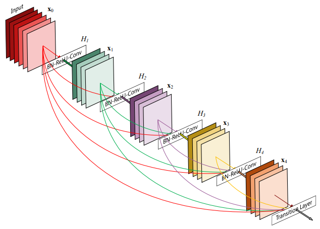
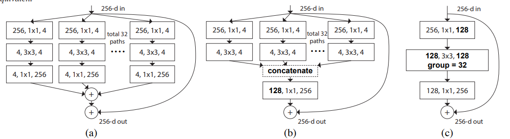

# [Train CIFAR10](https://github.com/hongyaohongyao/train_cifar)

This project explores the performance of some classical architecture of Convolution Neural Network on CIFAR10. 

Usage

- [Installation](##Installation)
- [Running](##Running) 

Experiments

- [Training Different Network Architecture](##Network Architecture)
- [Deeper or Wider?](##Deeper or Wider?) 
- [Activation Function and Layer Normalization](##Activation Function and Layer Normalization)
- [Augmentations](##Augmentations)

# Usage

## Installation

## Running

# Experiments

## Network Architecture

- [ResNet](https://arxiv.org/abs/1512.03385): The ResNet is a classical and strong baseline in compute vision. It introduce the residual structure into convolution neural network which solve the vanishing gradient problem and increase the depth of CNN. The experimental results demonstrate that the resnet is a stable network with good performance. 

  > Residual Block
  >
  > 

- [VGG](https://arxiv.org/abs/1409.1556):

- [DenseNet](https://arxiv.org/abs/1608.06993):

  > 

- [ResNeXt](https://arxiv.org/abs/1611.05431): The ResNeXt uses the Aggregated Residual to aggregated more convolution operation in one layer which is able to improve classification accuracy.

  > 

- [ConvMixer](https://arxiv.org/abs/2201.09792): The ConvMixer was proposed to answer a question: Is the performance of ViTs due to the inherently-more-powerful Transformer architecture, or is it at least partly due to using patches as the input representation? The network starts with a patches embeddings layer following with several DW layers. The source code training ConvMixer has reached over 95%, but it seems that more tricks are needed as it only has 93% acc with our training configuration.

| Model           | params(M) | Train Acc | Valid Acc |
| --------------- | --------- | --------- | --------- |
| resnet18        | 11.17     | 98.957    | 96.015    |
| vgg16           | 14.72     | 98.661    | 95.214    |
| densenet121     | 6.95      | 99.257    | 96.301    |
| resnext18       | 10.02     | 99.025    | 95.827    |
| convmixer256d16 | 1.28      | 98.649    | 93.701    |

## Deeper or Wider?

Intuitively, it's easy to improve the performance of the deep neural network by increasing the number of parameters. [Zagoruyko, S .et.al](https://arxiv.org/abs/1605.07146) show that the method to increase the parameters of the model is not only to deepen but also to widen the network. Inspired by this work, we compare the resnet34 with a modified resnet which has double channels and the same number of parameters as the resnet34. **Turns out the wider resnet lead to the better performance**.

| Model          | params(M) | Train Acc | Valid Acc |
| -------------- | --------- | --------- | --------- |
| resnet18       | 11.17     | 98.957    | 96.015    |
| resnet34       | 21.28     | 98.454    | 95.659    |
| wider resnet14 | 21.06     | 99.365    | 96.539    |

## Activation Function and Layer Normalization

We trained the resnet with 4 different activation function and 4 different  layer normalization methods. It's look like that the combination of relu activation and batch normlizaion leads to a best accuracy on CIFAR10

| Model    | Activation | Normalize layer | Train Acc | Valid Acc |
| -------- | ---------- | --------------- | --------- | --------- |
| resnet18 | Relu       | Batch Norm      | 99.090    | 96.193    |
| resnet18 | Leaky Relu | Batch Norm      | 99.992    | 95.372    |
| resnet18 | Celu       | Batch Norm      | 98.143    | 91.475    |
| resnet18 | Gelu       | Batch Norm      | 99.996    | 94.709    |
| -        | -          | -               | -         | -         |
| resnet18 | Relu       | Instance Norm   | 99.996    | 95.085    |
| resnet18 | Relu       | Layer Norm      | 99.994    | 95.115    |
| resnet18 | Relu       | Group Norm      | 99.996    | 95.045    |

## Augmentations

| Model           | Aug       | params(M) | Train Acc | Valid Acc |
| --------------- | --------- | --------- | --------- | --------- |
| resnet18        | -         | 11.17     | 99.090    | 96.193    |
| resnet18        | Erasing   | 11.17     | 98.957    | 96.015    |
| convmixer256d16 | -         | 1.28      | 99.954    | 92.692    |
| convmixer256d16 | Erasing   | 1.28      | 98.649    | 93.701    |
| vgg16           | -         | 14.72     | 99.986    | 94.165    |
| vgg16           | Erasing   | 14.72     | 98.661    | 95.214    |
| -               | -         | -         | -         | -         |
| resnet18        | Mixup 0.2 | 11.17     | 91.378    | 95.926    |
| resnet18        | Mixup 0.3 | 11.17     | 85.472    | 95.767    |
| resnet18        | Mixup 0.4 | 11.17     | 83.565    | 96.005    |
