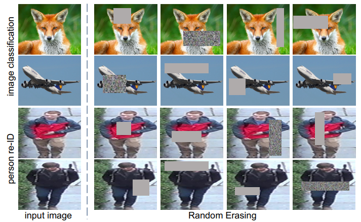
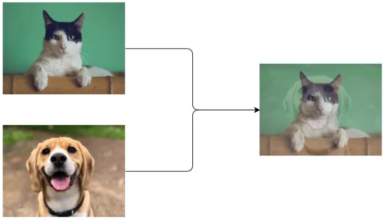

# [Train CIFAR10](https://github.com/hongyaohongyao/train_cifar)

This project explores the performance of some classic architectures and training methods of convolutional neural networks on CIFAR10.

Usage

- [Installation](#Installation)
- [Running Examples](#Running-Examples) 

Experiments

- [Training Different Network Architecture](#network-Architectures)
- [Deeper or Wider?](#Deeper-or-Wider) 
- [Activation Function and Layer Normalization](#Activation-Function-and-Layer-Normalization)
- [Augmentations](#Augmentations)

# Usage

## Installation

step 1. install [PyTorch](https://pytorch.org/) 

step 2. install denpendencies

```shell
pip install -r requirements [-i https://pypi.tuna.tsinghua.edu.cn/simple]
```

## Running Examples

training the resnet18 with the cosine annealing scheduler

```shell
python train.py --name <savedir> --arch resnet18 --sche cosine_annealing --lr 0.1 -e 250
```

training the desnet121 with multi-step scheduler and dropping the learning rate at epoch 20, 40, 60, 80.

```shell
python train.py --name <savedir> --arch densenet121 --lr 0.1 -m 20 -m 40 -m 60 -m 80
```

training the resnet18 with random erasing augmentation.

```shell
python train.py --name <savedir> --arch resnet18 --erase-aug
```

training the resnet18 with mixup augmentation.

```shell
python train.py --name <savedir> --arch resnet18 --mixup-aug --mixup-alpha 0.3
```

# Experiments

## Network Architectures

Find out which network architecture leads to better performance.

- [ResNet](https://arxiv.org/abs/1512.03385): ResNets is a classical and strong baseline in compute vision. ResNets introduce residual structure into convolutional neural network to solve the problem of gradient disappearance and increase the depth of CNN. The test results show that resnets are stable networks with good performance.

  > Residual Block
  >
  > 

- [VGG](https://arxiv.org/abs/1409.1556): Compared with previous work, AlexNets, VGG nets stack convolutional layers and pooling layers with smaller kernel size, which reduces parameters and improves classification accuracy.

- [DenseNet](https://arxiv.org/abs/1608.06993): Similar to deep residual networks, dense networks make connections between different layers but are denser. As shown in the table below, dense networks achieve the highest accuracy on CIFAR10 at smaller sizes. Practically, dense networks take up more memory at inference because the outputs of all layers are saved for concatenation.  

  > 

- [ResNeXt](https://arxiv.org/abs/1611.05431): ResNeXts use the aggregated residual layers to aggregated more convolution operation in one layer, thereby improving classification accuracy.

  > 

- [ConvMixer](https://arxiv.org/abs/2201.09792): The ConvMixer was proposed for a question: Is the performance of ViTs due to the inherently-more-powerful Transformer architecture, or is it at least partly due to using patches as the input representation? ConvMixers start with a patches embeddings layer followed by several DW layers. The source code to train ConvMixer has achieved over 95% accuracy, but it seems to require more tricks as it is only 93% accurate in our training configuration.

| Model           | params(M) | Train Acc | Valid Acc |
| --------------- | --------- | --------- | --------- |
| resnet18        | 11.17     | 98.957    | 96.015    |
| vgg16           | 14.72     | 98.661    | 95.214    |
| densenet121     | 6.95      | 99.257    | 96.301    |
| resnext18       | 10.02     | 99.025    | 95.827    |
| convmixer256d16 | 1.28      | 98.649    | 93.701    |

## Deeper or Wider?

Intuitively, it is easy to improve the performance of deep neural networks by increasing the number of parameters. [Zagoruyko, S .et.al](https://arxiv.org/abs/1605.07146) shows that the way to increase model parameters is not only to deepen the network, but also to widen the network. We compare the resnet34 with the modified resnets which have double channels and the same number of parameters as the resnet34. **It turns out that wider resnets lead to better performance**.

| Model          | params(M) | Train Acc | Valid Acc |
| -------------- | --------- | --------- | --------- |
| resnet18       | 11.17     | 98.957    | 96.015    |
| resnet34       | 21.28     | 98.454    | 95.659    |
| wider resnet14 | 21.06     | 99.365    | 96.539    |

## Activation Function and Layer Normalization

We trained the resnet with 4 different activation functions and 4 different  layer normalization methods. It appears that the combination of relu activation and batch normlizaion results in the best accuracy on CIFAR10.

| Model    | Activation | Normalize layer | Train Acc | Valid Acc |
| -------- | ---------- | --------------- | --------- | --------- |
| resnet18 | Relu       | Batch Norm      | 99.090    | 96.193    |
| resnet18 | Leaky Relu | Batch Norm      | 99.992    | 95.372    |
| resnet18 | Celu       | Batch Norm      | 98.143    | 91.475    |
| resnet18 | Gelu       | Batch Norm      | 99.996    | 94.709    |
| -        | -          | -               | -         | -         |
| resnet18 | Relu       | Instance Norm   | 99.996    | 95.085    |
| resnet18 | Relu       | Layer Norm      | 99.994    | 95.115    |
| resnet18 | Relu       | Group Norm      | 99.996    | 95.045    |

## Augmentations

- [Random Erasing](https://arxiv.org/abs/1708.04896v2): Erasing a rectangle area randomly from inputs, filling with the constant. As shown in the table below, random erasing reduces training accuracy while increasing validation accuracy, demonstrating that the method prevents overfitting.

  > 

- [Mixup](https://arxiv.org/abs/1710.09412): In essence, mixup trains a neural network on convex combinations of pairs of examples and their labels. As shown below, mixup improves the generalization of neural network architectures.

  > 

| Model           | Aug       | params(M) | Train Acc | Valid Acc |
| --------------- | --------- | --------- | --------- | --------- |
| resnet18        | -         | 11.17     | 99.090    | 96.193    |
| resnet18        | Erasing   | 11.17     | 98.957    | 96.015    |
| convmixer256d16 | -         | 1.28      | 99.954    | 92.692    |
| convmixer256d16 | Erasing   | 1.28      | 98.649    | 93.701    |
| vgg16           | -         | 14.72     | 99.986    | 94.165    |
| vgg16           | Erasing   | 14.72     | 98.661    | 95.214    |
| -               | -         | -         | -         | -         |
| resnet18        | Mixup 0.2 | 11.17     | 91.378    | 95.926    |
| resnet18        | Mixup 0.3 | 11.17     | 85.472    | 95.767    |
| resnet18        | Mixup 0.4 | 11.17     | 83.565    | 96.005    |
